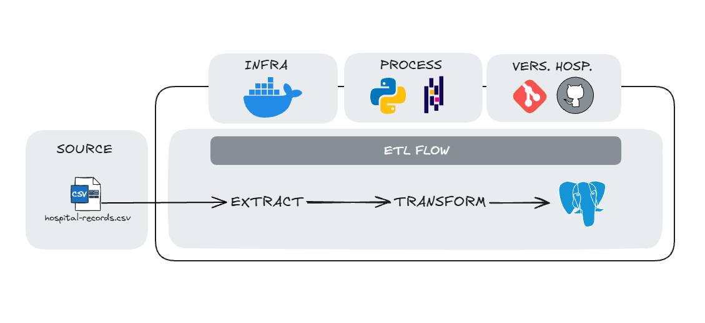

 # Pipeline ETL - Registros hospitalares

> Pipeline ETL automatizado para coleta, transformação e armazenamento de dados de pacientes de um hospital fictício.

---
 
## 🎯 Sobre o Projeto

Este projeto foi desenvolvido com o objetivo de construir um **pipeline ETL completo** utilizando as melhores práticas de Engenharia de Dados

O pipeline coleta dados de registros hospitalares, transforma os dados para um formato estruturado e os armazena em um banco de dados PostgreSQL para análises futuras.

---

## 🏗️ Arquitetura do Pipeline



---

## 🛠️ Stack Tecnológica

### Core
- **Python 3.14+** - Linguagem principal
- **PostgreSQL 16** - Banco de dados relacional

### Bibliotecas Python
- **pandas** - Manipulação e transformação de dados
- **requests** - Requisições HTTP para a API
- **SQLAlchemy** - ORM para interação com o banco de dados
- **psycopg2** - Driver PostgreSQL
- **python-dotenv** - Gerenciamento de variáveis de ambiente

### Outras Ferramentas
- **Jupyter Notebook** - Análise exploratória de dados
- **UV** - Gerenciador de pacotes Python rápido

---

## 🚀 Instalação e Configuração

### 1️⃣ Clone o Repositório

```bash
git clone https://github.com/JothanRAlmeida/Pipeline_ETL_HospitalRecords.git
cd Pipeline_ETL_HospitalRecords
```

### 2️⃣ Obtenha sua API Key do Kaggle

1. Acesse [Kaggle](https://www.kaggle.com/settings/api)
2. Crie uma conta gratuita
3. Gere sua API Key
4. Copie e cole o código para criar a pasta oculta **~/.kaggle/access_token**

### 3️⃣ Configure as Variáveis de Ambiente

Crie um arquivo `.env` dentro da pasta `config/`:

```bash
# config/.env

# PostgreSQL
user=exemplo
password=exemplo
database=exemplo
```

## 🔍 Detalhamento das Etapas

### 📥 **ETAPA 1: EXTRACT**

**Arquivo:** [`src/extract_data.py`](src/extract_data.py)

**O que faz:**
1. Cria uma instância da classe KaggleApi
2. Carrega as credenciais e autentica o usuário
3. Faz o dowload do arquivo do reposistório do Kaggle
4. Salva os dados brutos em formato CSV em `data/raw/hospital_patients_real_world.csv`

**Dados coletados:**
- Idade
- Gênero
- Diagnóstico
- Data de entrada
- Data de saída
- Hospital

---

### 🔄 **ETAPA 2: TRANSFORM**

**Arquivo:** [`src/transform_data.py`](src/transform_data.py)

**O que faz:**

#### 2.1 **Criação do DataFrame**
- Lê o arquivo CSV
- Converte para DataFrame Pandas

#### 2.2 **Conversão das colunas de data**
- Converte as colunas 'AdmissionDate' e 'DischargeDate' para datetime
- Formato "%Y-%m-%d"

#### 2.3 **Conversão da coluna de inteiro**
- Converte a coluna de idade para int

#### 2.4 **Padronização de valores**
Padroniza os diagnosticos:
- Remove os espaços em branco do inicio e fim
- Converte tudo em letra minúscula
- Converte a primeira letra para maiúscula

#### 2.5 **Preenchimento de valores ausentes**
Preenche as coluna 'Gender', 'Diagnosis' e 'Age':
- Gender: 'nan' para 'Unknown' - Categoria já existia
- Diagnosis: 'nan' para 'Unknown Diagnosis' - Nova categoria
- Age: 'nan' preenchido com a mediana (média e mediana muito próximos)

#### 2.6 **Definição de estadia inválida**
- Coluna 'DischargeDate' com data anterior a data da coluna 'AdmissionDate'
- Cria nova coluna booleana 'is_valid_stay'
- False = Estadia inválida

**Resultado:** DataFrame limpo, estruturado e pronto para análise

---

### 💾 **ETAPA 3: LOAD**

**Arquivo:** [`src/load_data.py`](src/load_data.py)

**O que faz:**

#### 3.1 **Conexão com o banco de dados**
```python
engine = create_engine(
    f"postgresql+psycopg2://{user}:{quote_plus(password)}@{host}:5432/{database}"
)
```

#### 3.2 **Inserção dos dados**
```python
df.to_sql(
    name='hospital_records',
    con=engine,
    if_exists='replace',  # reescreve todos os dados
    index=False
)
```

#### 3.3 **Validação**
- Faz um `SELECT` para verificar total de registros
- Loga o resultado para auditoria
---

## 🔎 Análise Exploratória dos dados
Para identificação de inconsistência e embasamento para tomada de decisão:

#### Valores Nulos
- Colunas Age, Gender e Diagnosis possuem valores nulos, cerca de 3% do total de dados:
    - Valores nulos da coluna Age foram preenchidos com a mediana. Apesar de não ter outliers relevantes, optou-se por não usar a média que seria um valor próximo da mediana.
    - Valores nulos da coluna Gender foram preenchidos com 'Unknown', uma categoria que já existia no conjunto de dados.
    - Valores nulos da coluna Diagnosis foram preenchidos com 'Unknown Diagnosis', uma nova categoria.

#### Valores iguais com escritas distintas
- Coluna Diagnosis possue valores iguais mas alguns escritos em caixa alta, contando como distinto:
     - Removidos os espaços em branco no início e fim dos valores;
     - Padronização de todos os valores com a primeira letra maiúscula e as demais em letra minúscula.

#### Tipo de Dado Incorreto
- Coluna Age se encontra como float:
    - A coluna foi convertida para inteiro.

#### Períodos Inválidos
- Datas de saída antes da data de entrada no hospital, cerca de 3% dos casos:
    - Foi criada uma nova coluna que determina se este período é válido ou não.
    - A nova coluna pode ser usava como filtro para análises futuras, não utilizando períodos inválidos.

## 🧪 Testes Locais 

Para testar o pipeline:

```bash
# Instale as dependências
uv pip install -e .

# Execute o script
uv run main.py
```